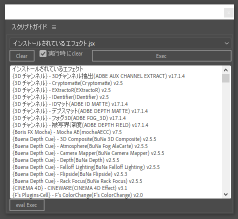
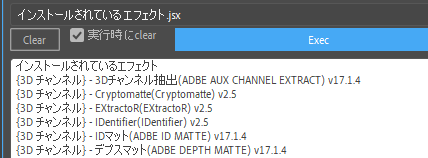
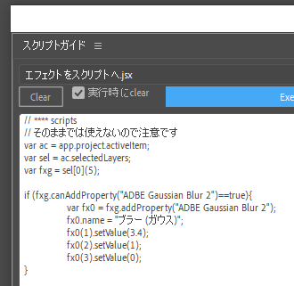
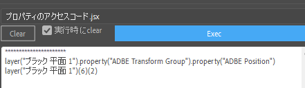
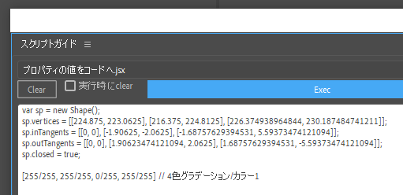
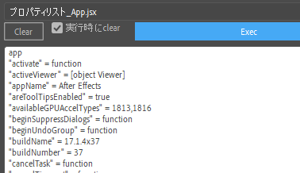
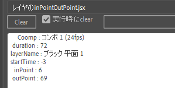

# スクリプトガイド.jsx
After Effectsのスクリプトやエクスプレッションを作成する際に必要な情報をAfter Effects自体で調べるために作ったスクリプトです。過去作った「**スクリプト作成アシスタント.jsx**」の新バージョンになります。


<!-- @import "[TOC]" {cmd="toc" depthFrom=1 depthTo=6 orderedList=false} -->

<!-- code_chunk_output -->

- [スクリプトガイド.jsx](#スクリプトガイドjsx)
  - [インストール](#インストール)
    - [僕のインストール方法](#僕のインストール方法)
  - [機能とその使い方](#機能とその使い方)
  - [付属スクリプトの説明](#付属スクリプトの説明)
    - [**lib.jsxinc**](#libjsxinc)
    - [**インストールされているエフェクト.jsx**](#インストールされているエフェクトjsx)
    - [**エフェクトをスクリプトへ.jsx**](#エフェクトをスクリプトへjsx)
    - [**バージョン.jsx**](#バージョンjsx)
    - [**プロパティのアクセスコード.jsx**](#プロパティのアクセスコードjsx)
    - [**プロパティの値をコードへ.jsx**](#プロパティの値をコードへjsx)
    - [**プロパティの情報.jsx**](#プロパティの情報jsx)
    - [**プロパティの情報詳細.jsx**](#プロパティの情報詳細jsx)
    - [**プロパティリスト_＊＊＊**](#プロパティリスト_)
    - [**レイヤのinPointOutPoint.jsx/ レイヤのinPointOutPointZERO.jsx**](#レイヤのinpointoutpointjsx-レイヤのinpointoutpointzerojsx)

<!-- /code_chunk_output -->


## インストール
* CS6の場合は、
**C:\Program Files\Adobe\Adobe After Effects CS6\Support Files\Scripts\ScriptUI Panels**

* CC2020の場合は
**C:\Users\(ユーザー名)\AppData\Roaming\Adobe\After Effects\17.1\Scripts\ScriptUI Panels**<br>または
**C:\Program Files\Adobe\Adobe After Effects 2020\Support Files\Scripts\ScriptUI Panels**

にすべてのファイルをいれてAfter Effectsを再起動させてください。AEのバージョンが変わると**17.1**の所も変わりるので注意してください。

メニューの**ScriptUI Panelsへインストール**は全てがコピーされないので使わないようにお願いします。

コピーするものは
name | 説明
--: | :--
(lib)フォルダ　| 僕が使うprototypeを使ったライブラリが入ってます。
(スクリプトガイド)フォルダ | スクリプトガイド.jsxが呼び出すスクリプトがが言っています。
スクリプトガイド.jsx| ランチャー型スクリプトです。

### 僕のインストール方法
僕はCS6とCC2020の両方を使うので面倒なので以下の方法でインストールしてます。

1. 適当な場所に**Scripts**フォルダを作成。
ここでは"C:\Bin\Scripts"フォルダとします。
2. そのフォルダにCC2020の**Scripts**の中身をフォルダまとめて複製します。
3. **Startup**にある**commandLineRenderer.jsx**はCS6/CC2020両方動くように修正します（しないと**aerender**が動かなくなる）
4. AEが起動していたら落とします。
5. AEの**Scripts**フォルダをリネームして**Scripts_backup**とかにします。
6. 以下の管理者権限で起動したCMDで以下のコマンドを実行します。
<div style="page-break-before:always"></div>

```
MKLINK /D "C:\Program Files\Adobe\Adobe After Effects CS6\Support Files\Scripts" "C:\Bin\Scripts"

MKLINK /D "C:\Program Files\Adobe\Adobe After Effects 2020\Support Files\Scripts" "C:\Bin\Scripts"

```
* 簡単に言うとジャンクジョンで1個のフォルダをCS6 / CC2020用にリンクしてるってことです。修正場所が一つになり楽です。
* オマケにgitに登録して簡単にバックアップできるようにしてあります。
* 注意としては、プリセット(*.ffx)を使う場合はメニューをCS6用CC2020用に別に作らないと行けません。

* また、startupフォルダ内にある**commandLineRenderer.jsx**はCS6とCC202で互換性がないので注意です。
僕は修正してどちらでも動くものにしてしまいました。

<div style="page-break-before:always"></div>

## 機能とその使い方
* 今回機能を全部別ファイルにして簡単に機能追加できるようにしました。
* ファイルを分ける事でメンテもやりやすくなりました。

<div style="text-align: center;"></div>

* 基本的な使い方は、上部のドロップダウンリストで使いたい機能を選んだあと、ターゲットとなるものを選択してExecボタンを押します。
* 表示されたものはコピー&ペーストできます。

* 実行されるスクリプトは同じ階層にある(**スクリプトガイド**)に入っています。ここにあるスクリプトはこのメニュー専用で単独で使用できないので注意してください。必要ないと思うものは適当にフォルダ作って入れておくか、拡張子をjsx以外のものに変えれば読み込まれません
* このメニューで呼び出されるスクリプトでは、
  * **wrt**()
  * **wrtLn**()
  * **log**()
  * **clear**()
  関数が使えます。引数の文字列をコンソールへ出力します。
* このメニューがロードされている間は
  **CONSOL.write / CONSOL.writeLn / CONSOL.log / CONSOLE.clear**が使えます。
  デバッグ用の文字列出力に使えます。
* **eval Exec**ボタンは、上のエディットパネルにある文字列をそのまま**eval**に引き渡します。**alert("AAA");** とか打ち込めます。**wrtLn("AAA");** でコンソールに出力ができます、
* コンソールで改行は**Shif+Return**です。


<div style="page-break-before:always"></div>


## 付属スクリプトの説明

### **lib.jsxinc**

* 共通で使われる関数等を入れたライブラリファイルです。メインのスクリプトがロードされた時に読み込まれます。<br>

### **インストールされているエフェクト.jsx**
<div style="text-align: center;"></div>

* after effectsにインストールされているエフェクトプラグインの一覧を表示します。
CC2020は何故か文字化けするので無理やり修正しています。

### **エフェクトをスクリプトへ.jsx**
<div style="text-align: center;"></div>

* 選択したレイヤのエフェクトを構築するスクリプトを作成します。
完全ではありませんので注意です。コンポジットオプション等は構築されません。
* これが完全にできればバージョン依存のあるプリセット(ffx)を排除できるのですがうまくいきません。

### **バージョン.jsx**
* 単純にバージョンを表示するだけです。


### **プロパティのアクセスコード.jsx**
<div style="text-align: center;"></div>

* 選択したプロパティへのアクセルコードを出力します。
mactNameを使った名前によるアクセスコードと、インデックス番号を使ったものの2個表示します。

### **プロパティの値をコードへ.jsx**
<div style="text-align: center;"></div>

* 選択したプロパティの値をコード化します。
通常の数値とテキストソースとパスもコード化します。


<div style="page-break-before:always"></div>

### **プロパティの情報.jsx**
<div style="text-align: center;"></div>

* 選択したプロパティ・プロパティグループのよく調べる情報を表示します。

### **プロパティの情報詳細.jsx**
* 選択したプロパティ・プロパティグループのよく調べる情報すべてを表示します。

<div style="page-break-before:always"></div>

### **プロパティリスト_＊＊＊**
<div style="text-align: center;"></div>

* プロパティリスト_＊＊＊は対象のプロパティリストを表示します。
なるべくその値も表示しますが細かいところまでは出来ません。
<br>

|ターゲット|選択ターゲット|内容|
| - | - | - |
|aftereffects|なし|グローバル変数aftereffectsのプロパティリストを返します。|
| app | なし | appのプロパティリストを返します |
| $(Doller) | なし | $のプロパティリストを返します |
| global | なし | lobalのプロパティリストを返します |
| Layer | レイヤ | 選択したレイヤのプロパティリストを返します |
| Project | なし | app.projectのプロパティリストを返します |
| ProjectItem | Item | プロジェクトパネルで選択さえたもののプロパティリストを返します |
| Property | プロパティ | 選択したプロパティのプロパティリストを返します |
| PropertyGroup | プロパティグループ | 選択したプロパティグループのプロパティリストを返します |
| System | なし | systemのプロパティリストを返します |

<div style="page-break-before:always"></div>

### **レイヤのinPointOutPoint.jsx/ レイヤのinPointOutPointZERO.jsx**
<div style="text-align: center;"></div>


* 選択したレイヤのin点・out点・スタートタイムをコマ数で表示します。
* ZeroがついているのはDisplayStartFrameを考慮しないものです。


***

bry-ful (Hiroshi Furuhashi)
gmail : bryful@gmail.com
twitter : bryful [(https://twitter.com/bryful](https://twitter.com/bryful)
github : [https://github.com/bryful](https://github.com/bryful)
