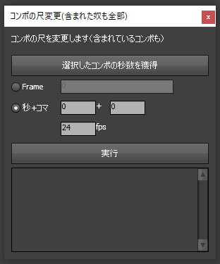

# コンポの尺変更（含まれた奴も全部）.jsx
Afte Effectsのスクリプトです。

コンポの尺を変更します。その際そのコンポのレイヤーのソースがコンポで変更後の尺より短いものは尺を伸ばします。

## インストール

CS6の場合
> C:\Program Files\Adobe\Adobe After Effects CS6\Support Files\Scripts\ScriptUI Panels

CC2020の場合
>C:\Program Files\Adobe\Adobe After Effects 2020\Support Files\Scripts\ScriptUI Panels

**Scripts**フォルダの**ScriptUI Panels**に**コンポの尺変更（含まれた奴も全部）.jsx**を移動してください。
AEの再起動後、ウィンドウメニューに表示されます。

## 使い方
1. 「選択したコンポの秒数を獲得」でコンポの秒数を獲得できます。特にしなくても問題ありません。

2. Frameもしくは秒+コマをどちらかを選んで、新しい尺を入力してください。fpsはコンポと同じ値にしてください。コンポと違う場合は尺変更はしません。

3. 尺変更したいコンポを選んで、実行ボタンを押せば尺変更が行われて、変更したコンポが下に表示されます。複数選択して実行できますが、注意してください。

1. レイヤのout点がコンポの最後にある場合は、修正を行います。

1. 修正した履歴が下に表示されるので、メモ帳なりにコピー&ペーストしておけば、修正後の確認が楽になります。

## 注意
* レイヤのイン点がマイナスの場合や時間伸縮等の尺関係の操作を行っていた場合、尺を伸ばす際におかしくなる可能性があります。

* 使われているコンポの尺が足りない場合は尺を伸ばしますが、足りている場合（尺が長い）は短くはしませんので注意してください。

* レイヤのアウト点が最後まである場合は、尺が伸びた場合それに応じてレイヤのアウト点を修正します。アウト点が最後まで行ってない場合は何もしません。

## その他 

* 趣味で作ったものですので、仕事で作ったものではありません。
* MITライセンスです。自由に使えます。
* **即興で作ったので何かあった言ってください。対処します。**

## 

bry-ful (Hiroshi Furuhashi)  
gmail : bryful@gmail.com  
twitter : bryful [https://twitter.com/bryful](https://twitter.com/bryful)  
github : [https://github.com/bryful](https://github.com/bryful)  

